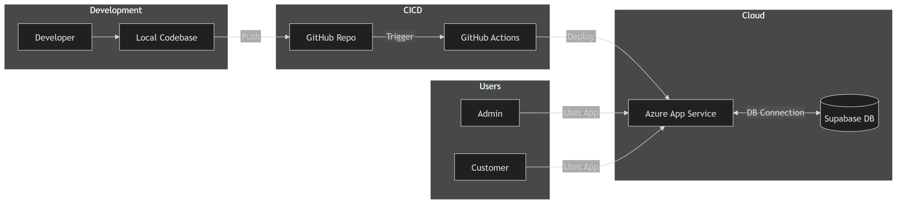

# 📦 Real-Time Inventory Management System

This project is a Python-based real-time inventory management system designed to help shop owners efficiently track, manage, and record stock, customer orders, and sales. It uses Supabase (PostgreSQL in the cloud) as the backend database, and integrates OOP principles, database transactions, and secure password handling to ensure reliability and scalability.

## ✨ Features

- 🗂️ Customer Management – Add and store customer details with encrypted passwords
- 📊 Inventory Tracking – Manage product details (stock, price, discounts, etc.) in real-time
- 🛒 Order Processing – Handle customer purchases with support for multiple products per order
- 🔄 Transaction Pooling – Ensures safe and efficient database operations with psycopg2
- 🔐 Security – Passwords are hashed before storing in the database
- 📈 Analytics Ready – Inventory and sales data can be visualized for insights into buying behavior
-  🔐Add role-based authentication (Admin vs Customer)

## 🛠️ Tech Stack

- Language: Python (OOP)
- Database: Supabase (PostgreSQL)
- ORM/DB Driver: psycopg2 (connection pooling enabled)
- Visualization: Matplotlib / Seaborn
- Version Control: Git + GitHub

## ✅ Prerequisites

- Python 3.9+
- A Supabase project (or any PostgreSQL database)
- `pip` installed

## Deployment workflow


## ⚙️ Setup and Run (Step-by-Step)

### 1. Create and activate virtual environment

Windows (PowerShell):

```powershell
python -m venv .venv
.\.venv\Scripts\Activate.ps1
```

Windows (CMD):

```cmd
python -m venv .venv
.venv\Scripts\activate.bat
```

macOS/Linux:

```bash
python3 -m venv .venv
source .venv/bin/activate
```

### 2. Install required packages

```bash
pip install -r requirements.txt
```

### 3. Configure environment variables

Create a `.env` file inside the `Code` folder and add:

```env
DB_USER=YOUR_DB_USER
DB_PASSWORD=YOUR_DB_PASSWORD
DB_HOST=YOUR_DB_HOST
DB_NAME=YOUR_DB_NAME
DB_PORT=5432
```

Note: These exact variable names are used by the app in `utils/DataBase.py`.

### 4. Initialize database tables

Your app expects these tables:

- `customers`
- `zepto_v2`
- `cart_details`
- `orders`
- `order_items`

You can either:

1. Restore from backup: `backup/db_cluster-18-09-2025@19-35-59.backup`
2. Or create tables manually in Supabase SQL Editor.

Minimal schema to start quickly:

```sql
CREATE TABLE IF NOT EXISTS customers (
	customer_id SERIAL PRIMARY KEY,
	name VARCHAR(100) NOT NULL,
	address TEXT,
	pincode VARCHAR(10),
	phone_no VARCHAR(15) UNIQUE NOT NULL,
	password_hash TEXT NOT NULL
);

CREATE TABLE IF NOT EXISTS zepto_v2 (
	item_id SERIAL PRIMARY KEY,
	"Category" TEXT NOT NULL,
	name TEXT,
	mrp BIGINT,
	"discountPercent" TEXT,
	"discountedSellingPrice" BIGINT,
	"weightInGms" BIGINT,
	"outOfStock" BOOLEAN,
	quantity BIGINT
);

CREATE TABLE IF NOT EXISTS cart_details (
	cart_id SERIAL PRIMARY KEY,
	item_id INT NOT NULL,
	quantity INT NOT NULL,
	customer_id INT,
	name TEXT,
	price BIGINT
);

CREATE TABLE IF NOT EXISTS orders (
	order_id SERIAL PRIMARY KEY,
	customer_id INT NOT NULL REFERENCES customers(customer_id),
	order_timestamp TIMESTAMP DEFAULT CURRENT_TIMESTAMP,
	order_status VARCHAR(20) DEFAULT 'pending',
	total_amount_paid BIGINT
);

CREATE TABLE IF NOT EXISTS order_items (
	order_item_id SERIAL PRIMARY KEY,
	order_id INT NOT NULL REFERENCES orders(order_id) ON DELETE CASCADE,
	item_id INT NOT NULL,
	quantity INT NOT NULL,
	amount_paid NUMERIC(10,2) NOT NULL,
	name TEXT
);
```

### 5. Load product data into `zepto_v2`

Import the CSV file at:

- `Zepto inventory dataset/zepto_v2.csv`

You can import this through Supabase Table Editor (CSV import) for table `zepto_v2`.

### 6. Start the Streamlit app

```bash
streamlit run streamlit_app.py
```

App should open automatically in browser (usually on `http://localhost:8501`).

### 7. Login details

- Admin login:
  - Username: `admin`
  - Password: `admin@123`
- Customer login:
  - Create account using Sign Up from the app

## ▶️ Optional: Run CLI version

If you want terminal-based interaction instead of Streamlit UI:

```bash
python main.py
```

## 🧯 Troubleshooting

- `Error connecting to PostgreSQL database`: verify `.env` values (`host`, `dbname`, `user`, `password`, `port`).
- `relation does not exist`: required tables are not created yet.
- Admin insights/bills not generated: ensure folders `insights_img`, `Inventory_Insights`, and `order_bills` exist (app usually creates output folders when needed).

## 🚀 Future Improvements
- Integrate visualization dashboards (sales trends, product demand, etc.)
- Expose REST APIs for frontend or mobile integration

## Video Demo of Project
- [!Watch the video](https://www.linkedin.com/posts/riccoshubham_python-supabase-postgresql-ugcPost-7371959764836306944-xWxd?utm_source=share&utm_medium=member_desktop&rcm=ACoAADE2h3cBX01qWrGrBr3icVyP1A2Uh21b9hE)
